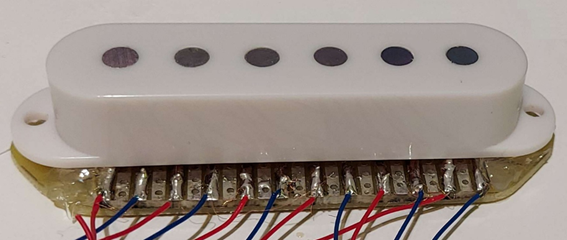
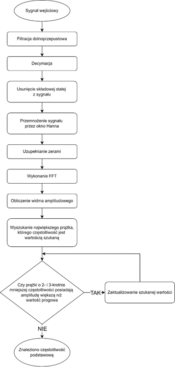
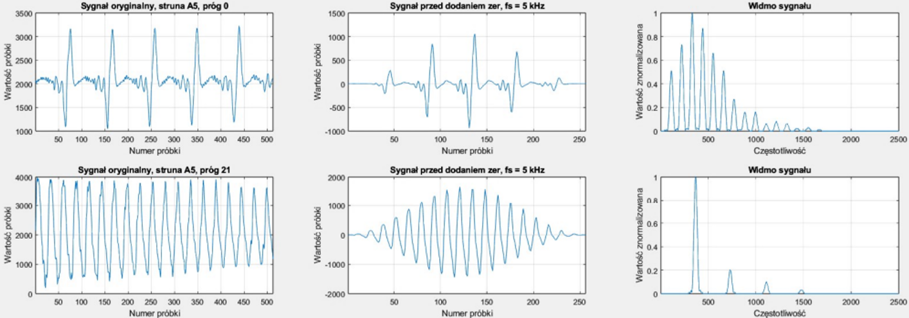

# Polifoniczny Kontroler MIDI do Gitary Elektrycznej
### _Polyphonic Real-time Audio to MIDI Converter for Electric Guitar_

Projekt zrealizowany w ramach pracy inżynierskiej na Politechnice Wrocławskiej. System umożliwia konwersję sygnału audio z każdej struny gitary elektrycznej na niezależne komunikaty MIDI w czasie rzeczywistym. Głównym celem było stworzenie uniwersalnego i unikalnego rozwiązania opartego o własnoręcznie wykonany przetwornik polifoniczny, pozwalającego na sterowanie wirtualnymi instrumentami (VST) i syntezatorami sprzętowymi z zachowaniem niskiego opóźnienia.

_Rys. 1: Gotowy, własnoręcznie wykonany 6-kanałowy przetwornik gitarowy._

---

## Kluczowe Funkcje i Założenia Projektowe

- 🎸 **Pełna Polifonia:** Niezależne przetwarzanie sygnału dla każdej z sześciu strun gitary.
- ⚡ **Niskie Opóźnienie:** Całkowity czas od uderzenia w strunę do wysłania komunikatu MIDI poniżej 50 ms, co umożliwia grę na żywo.
- 📡 **Elastyczna Komunikacja:** Wsparcie dla wielu interfejsów:
    - **Przewodowo przez USB:** Dla maksymalnej stabilności i minimalnego opóźnienia.
    - **Bezprzewodowo przez ESP-NOW:** Niskopoziomowy protokół Wi-Fi zapewniający szybką komunikację z dedykowanym odbiornikiem USB.
    - **Bezprzewodowo przez Bluetooth LE MIDI:** Standardowa komunikacja z komputerami i urządzeniami mobilnymi.
- 🎼 **Wbudowany Stroik Cyfrowy:** Interfejs użytkownika z wyświetlaczem OLED pokazujący częstotliwość strojonej struny.
- 🎛️ **Interfejs Użytkownika:** Prosta obsługa za pomocą przycisków i przełączników do wyboru trybu pracy i komunikacji.

---

## Architektura Systemu

Urządzenie jest systemem modułowym, którego architekturę przedstawia poniższy schemat.

_Rys. 2: Schemat blokowy kontrolera._

1.  **Przetwornik Polifoniczny:** Sześć osobnych cewek nawiniętych na magnesach AlNiCo5 generuje niezależne sygnały dla każdej struny.
2.  **Sześciokanałowy Wzmacniacz:** Sygnały z przetwornika są wzmacniane i kondycjonowane (dodanie składowej stałej) przy użyciu wzmacniaczy operacyjnych MCP6002, przygotowując je do digitalizacji.
3.  **Główna Jednostka Przetwarzająca (STM32F446RE):**
    - Próbkowanie 6 kanałów z częstotliwością 10 kHz przy użyciu 12-bitowego przetwornika ADC.
    - Implementacja zoptymalizowanego algorytmu DSP do wykrywania częstotliwości podstawowej.
    - Konwersja wykrytej częstotliwości na komunikaty MIDI.
    - Komunikacja z modułem ESP32 poprzez interfejs UART.
4.  **Moduł Komunikacji i Interfejsu Użytkownika (ESP32):**
    - Odbiera komunikaty MIDI od STM32.
    - Obsługuje wyświetlacz OLED oraz przyciski.
    - Realizuje transmisję bezprzewodową (Bluetooth / ESP-NOW).
5.  **Odbiornik USB (ESP8266):** W trybie ESP-NOW, dedykowany odbiornik podłączony do komputera odbiera dane i przekazuje je jako wirtualny port MIDI.

---

## Algorytm Wykrywania Częstotliwości

Sercem oprogramowania jest algorytm DSP, którego działanie przedstawia poniższy schemat.

_Rys. 3: Schemat blokowy algorytmu wykrywającego częstotliwość podstawową sygnału._

Kluczowe kroki dla każdego kanału:
1.  **Filtracja dolnoprzepustowa i decymacja** w celu dopasowania pasma do analizowanej struny i optymalizacji obliczeń.
2.  **Usunięcie składowej stałej** i nałożenie **funkcji okna Hanninga** w celu przygotowania sygnału do analizy FFT.
3.  Obliczenie **Szybkiej Transformacji Fouriera (FFT)** przy użyciu biblioteki CMSIS-DSP.
4.  **Analiza widma amplitudowego** i wyszukanie maksimum. Ze względu na charakter sygnału gitarowego, algorytm sprawdza również subharmoniczne (f/2, f/3), aby poprawnie zidentyfikować częstotliwość podstawową, a nie jej silniejszą harmoniczną.

_Rys. 4: Przykładowe widmo sygnału ze struny A5 (próg 0 i 21) z wyraźnie widoczną częstotliwością podstawową i jej harmonicznymi._

---

## Zastosowane Technologie

#### 🛠️ Sprzęt
- **Główny Mikrokontroler:** STM32F446RE (na płytce NUCLEO-F446RE)
- **Moduł Komunikacyjny:** ESP32 (na płytce NodeMCU-32S)
- **Odbiornik:** ESP8266 (na płytce NodeMCU D1 mini)
- **Wzmacniacze Operacyjne:** MCP6002 (Rail-to-Rail)
- **Wyświetlacz:** OLED 0.96" I²C (SSD1306)
- **Przetwornik:** Własna konstrukcja oparta o magnesy AlNiCo5 i drut miedziany 0,06 mm.

#### 💻 Oprogramowanie i Biblioteki
- **Język:** C/C++
- **Środowiska:** STM32CubeIDE, Arduino IDE
- **Kluczowe Biblioteki:** STM32 HAL, CMSIS-DSP, Adafruit GFX & SSD1306, Arduino MIDI Library, BLE-MIDI
- **Oprogramowanie PC:** Hairless MIDI<->Serial Bridge, loopMIDI

---

## Wyzwania i Rozwiązania

- **Wyzwanie:** Ograniczona moc obliczeniowa STM32 do przetworzenia 6 kanałów w czasie rzeczywistym.
    - **Rozwiązanie:** Optymalizacja parametrów (długość próbki, częstotliwość próbkowania), zastosowanie decymacji oraz wykorzystanie sprzętowo akcelerowanych bibliotek CMSIS-DSP.
- **Wyzwanie:** Przesłuchy (crosstalk) między cewkami własnoręcznie wykonanego przetwornika.
    - **Rozwiązanie (Programowe):** Implementacja logiki porównującej wykryte nuty na sąsiednich kanałach; w przypadku wykrycia tej samej nuty komunikat MIDI jest wysyłany tylko raz.
    - **Dalszy rozwój:** Wymagane byłoby lepsze ekranowanie cewek.

---

## Licencja

Ten projekt jest udostępniony na licencji MIT - zobacz plik [LICENSE](LICENSE) po szczegóły.